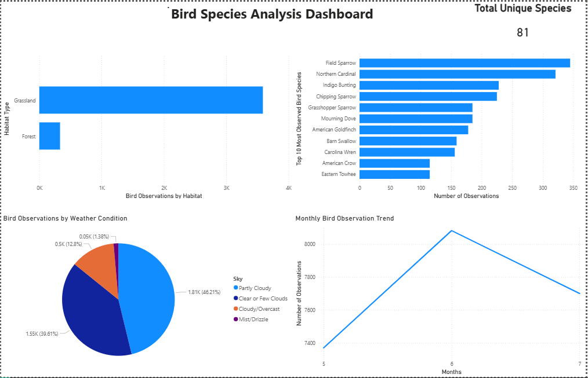

# Bird Species Analysis

This project analyzes bird observation data using SQL, Python, and Power BI to extract meaningful insights about species distribution, habitat patterns, biodiversity, and environmental impact.

---

## Tools & Technologies Used
- SQL
- Python (Pandas, Jupyter Notebook)
- Power BI
- CSV Dataset

---

## Dataset
The dataset contains bird observation records including:
- Common Name
- Scientific Name
- Location Type
- Weather Conditions (Sky)
- Observation details

---

## Key Insights

- Identified the **top 10 most observed bird species** based on frequency  
- Analyzed **habitat-wise distribution** of bird observations (urban, forest, etc.)  
- Calculated **total biodiversity** using distinct species count  
- Examined **impact of weather conditions** (sky type) on bird sightings  

---

## SQL Analysis

Some of the key SQL queries used:

```sql
-- Habitat Comparison
SELECT Location_Type, COUNT(*) AS total_obs
FROM bird_data
GROUP BY Location_Type;

-- Top 10 Species
SELECT Common_Name, COUNT(*) AS species_count
FROM bird_data
GROUP BY Common_Name
ORDER BY species_count DESC
LIMIT 10;

-- Biodiversity
SELECT COUNT(DISTINCT Scientific_Name) AS total_species
FROM bird_data;

-- Weather Impact
SELECT Sky, COUNT(*) AS observations
FROM bird_data
GROUP BY Sky;
```

## Dashboard

Power BI dashboard provides interactive visualizations for:
- Species distribution  
- Habitat comparison  
- Observation trends  
- Weather impact on sightings  


